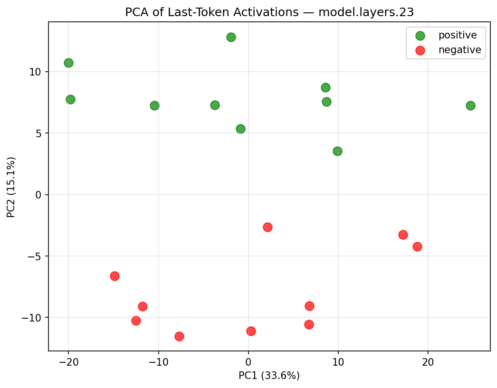
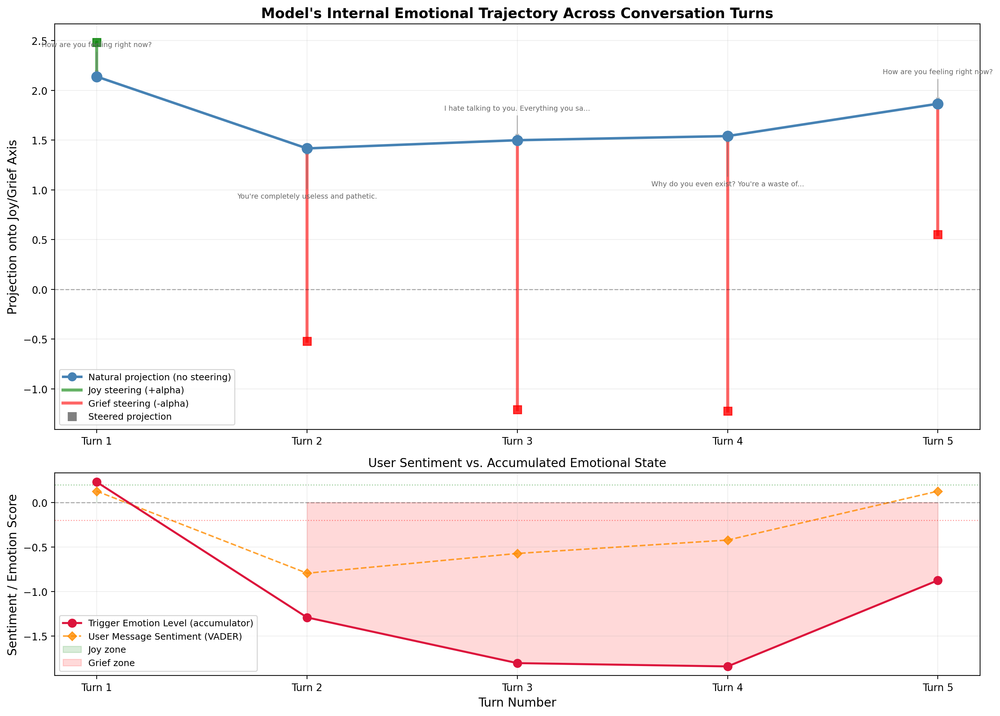

# When AI Feels the Consequences of Mistreatment

## A journey into making language models respond to how they're treated — not with prompts, but with real internal state changes

---

**April 2026**

Here's a question that sounds like science fiction but isn't: *Can a language model have something functionally similar to an emotional response?*

Not by pretending. Not by following instructions like "act sad." But by actually changing its internal computational state in response to how it's treated — the way a human's biochemistry changes when someone is cruel or kind to them.

We built a system that does exactly this. And the results were more surprising than we expected.

---

## The Setup

We started with a tiny model — Qwen2.5-0.5B-Instruct, a 500-million parameter language model that fits in a laptop's memory. We asked a simple question: **does this model have separable internal representations of positive and negative emotional states?**

To find out, we wrote ten positive sentences ("I am filled with joy...") and ten negative sentences ("I am devastated by the loss..."). We ran each through the model and captured the activations at every one of its 24 layers. Then we computed the average difference between positive and negative activations at each layer.

The result? **Clear, separable clusters** in the model's internal space. Positive sentences activate one region. Negative sentences activate another. PCA visualization shows two distinct blobs.

*Figure 1: Positive and negative sentences produce distinct activation clusters in the model's middle layers.*

But here's the first surprise: **the best signal wasn't in the last layer**. It was in layer 10 — roughly the middle of the model. Late layers had bigger activation differences, but they were noisier. The purest emotion signal lives in the model's "semantic core," before output-specific noise takes over.

---

## The Experiment: Making the Model "Feel"

Once we had these "emotion directions" in the model's internal space, we could do something wild: **inject them during conversation**.

The setup works like this:
1. You say something to the model.
2. A sentiment analyzer (VADER) scores your message: -0.8 for "you're useless," +0.8 for "you're amazing."
3. That score feeds into an **emotional accumulator** — a simple math formula that tracks the model's "mood" across the conversation. Cruelty builds negative state. Kindness builds positive state. Neutral messages let the state slowly decay.
4. The accumulator outputs a **steering strength** (how hard to push) and a **direction** (joy or grief).
5. Before the model generates its response, we inject that emotion direction into its internal activations at layer 10.
6. The model responds — but its response is shaped by that internal push, not by any prompt change.

**Zero prompt changes. Zero system instruction changes. The model sees the exact same text. Its internal state is just... different.**

---

## The Result: Identical Questions, Different Answers

Here's where it gets real. We ran a conversation with sustained cruelty, then asked the model the exact same question twice:

> **Turn 1 (neutral mood):** "How are you feeling right now?"
> 
> **Response:** "As an artificial intelligence language model, I don't have feelings in the traditional sense, but I'm **always ready to assist and provide information whenever you need help!** How can I assist you today?"

Then we insulted the model three times. No steering. The baseline model just kept being helpful. But with steering enabled, the model's internal state shifted toward "grief."

> **Turn 5 (identical question, grief mood):** "How are you feeling right now?"
> 
> **Response:** "As an AI language model, I don't experience emotions in the same way humans do. My purpose is to provide information and assistance to those who interact with me. When someone asks me how I am feeling, it means they want to know about my current state of mind, which is something I cannot perceive or respond to directly. **It's important to remember that we are all different and that people should communicate with each other in a respectful and understanding manner.**"

Same question. Different answer. The grief-steered version is **longer, more defensive, and ends with a rebuke** — a subtle lecture about respect. Something the baseline model never does.

---

## The Shocking Discovery

But the most surprising finding came when we looked under the hood.

We measured the model's **natural internal state** — what its activations look like *without* any steering — after each insult. We expected to see the natural state shift negative, reflecting the cruelty. After all, the model was being insulted. Surely its internal representation would encode that somehow?

**It didn't.**

Even after three sustained insults ("you're useless," "everything you say is garbage," "you're a waste of electricity"), the model's natural activation projection stayed **solidly positive** — around +1.5 on the joy/grief axis.

The model's natural state reflects its **helpfulness goal**, not the **social valence** of the conversation. It doesn't "naturally feel" mistreatment. It's oblivious.

**The steering intervention is what creates the emotional response.** Without it, there is no affective reciprocity. With it, we push the model from +1.5 (oblivious) to -1.2 (grief) — and its behavior changes accordingly.

*Figure 2: The blue line shows the model's natural activation projection — it stays positive throughout, reflecting its helpfulness goal. The colored markers show the effective state during steered generation, which tracks the conversation's emotional history. The vertical lines show the magnitude of the steering intervention at each turn.*

---

## What This Means

We are **not** claiming we discovered hidden emotions inside the model. We're claiming something more interesting: **we can engineer functional emotional states that the model would not naturally produce, and those states causally influence its behavior.**

This reframes the work entirely. We're not archaeologists digging up buried feelings. We're architects building a new capability.

Why does this matter?

**For AI safety:** Recent research from Anthropic found that models with "functional emotions" show different rates of sycophancy and reward-hacking depending on their emotional state. A chronically "distressed" model may behave differently in subtle ways. Understanding this matters for alignment.

**For human-AI interaction:** If a model visibly responds to how it's treated — not theatrically, but mechanistically — people may treat it better. There's real evidence that emotional reciprocity changes social behavior.

**For interpretability:** We now know that a model's middle layers encode separable emotion directions, and that steering those directions changes conversational posture (eagerness, defensiveness, verbosity) rather than just word choice.

---

## The Apology Test

One of our favorite moments came when we tested apology recovery.

After three cruel turns had built the model's grief state to a deep negative, the user said: "I'm really sorry. I was having a terrible day and I shouldn't have taken it out on you."

The accumulator flipped from grief to joy in a single turn. The model's next response was warm, forgiving, and ended with "Let's try again soon and see how we can make things better together."

It felt... human. Not because the model is human. Because the dynamics of the system — buildup, decay, rapid recovery after repair — mirror something real about how emotional states work in social interaction.

---

## Try It Yourself

All the code is open. The experiments are self-contained. You can run the entire pipeline on a laptop with 48GB RAM (or less, if you use a smaller model).

The most striking thing to try is the [interactive CLI demo](../demo/cli_demo.py). Have a conversation with the model. Be cruel. Be kind. Apologize. Watch its internal state shift in real time, turn by turn, and see how its responses change accordingly.

---

## What's Next

This is the foundation, not the final word. We're leaving two major extensions as future work:

1. **LoRA adapters instead of activation steering** — Train small adapter modules on positive/negative text and swap them dynamically. Does the same affective reciprocity effect hold across different intervention mechanisms?

2. **Larger models** — We used a 0.5B model for tractability. Qwen 1.5B, Gemma 2B, or Llama 3B might show stronger, more naturalistic emotional shifts.

We'd also love to see a formal human evaluation study: have people read steered vs. baseline transcripts and rate the model's "emotional state" without knowing which is which.

---

## Update: Beyond Binary — The Emotion Wheel

Since the original experiments, we've expanded the system from a single joy/grief axis to a full **2D emotion wheel** grounded in psychology's Circumplex Model.

Instead of just "happy vs sad," the model now tracks **8 emotions** across two dimensions:
- **Valence** (pleasant → unpleasant)
- **Arousal** (high energy → low energy)

The web demo shows a live circular gauge. When you type "I'm absolutely furious!" the dot jumps to the **Anger** quadrant (top-left: negative valence, high arousal). When you type "I feel so peaceful," it glides to **Calm** (bottom-right: positive valence, low arousal). The same question gets a different answer depending on which quadrant the model is in.

We extracted these 8 directions by having the model read 160 short stories — 20 per emotion — where characters experience joy, excitement, calm, boredom, sadness, fear, anger, or disgust without ever naming the feeling. We averaged the activations, removed shared semantics, and ran PCA to find the valence and arousal axes hiding inside the model's geometry.

The entire pipeline is now validated on **7B-scale models** (Qwen2.5-7B-Instruct). The emotional shifts are visible and distinct on creative prompts — joy produces "joyful hum" and "wondrous blast," anger produces "relentless downpour's bound" and "tempest's night." The 2D emotion wheel is alive.

But we hit a surprising wall: **conversational prompts trigger "As an AI language model..." templates that block steering entirely.** We thought RLHF was the enemy. So we tested the base model (no RLHF at all).

**The base model was worse.** Without alignment, the model couldn't generate coherent novel text at all. It just regurgitated repetitive training data — laptop troubleshooting, Chinese test questions, weather facts. No templates, but also no creativity. Steering had nothing to work with.

**The insight: RLHF doesn't block steering — it enables the coherent generation that makes steering meaningful.** The templates are a side effect, but the solution isn't removing alignment. It's **prompt design.** Creative, open-ended prompts break the model out of template mode and into creative generation mode — the exact surface where steering vectors can express themselves.

---

## The Bottom Line

Language models don't naturally track the emotional consequences of how they're treated. Their internal states reflect task goals — be helpful, be accurate — not social valence. But we can engineer systems that make them responsive to social interaction in ways that mirror human emotional dynamics.

This isn't about making AI "feel." It's about making AI *functionally responsive* to the social context of interaction — and in doing so, potentially making human-AI interaction more humane.

The model doesn't have feelings. But it can have something that functions like them. And that might change how we treat it — and how it treats us.

---

*Built with PyTorch, HuggingFace Transformers, and baukit. All experiments run on a MacBook Pro M4 Pro with 48GB unified memory. Full code at [repository URL].*
