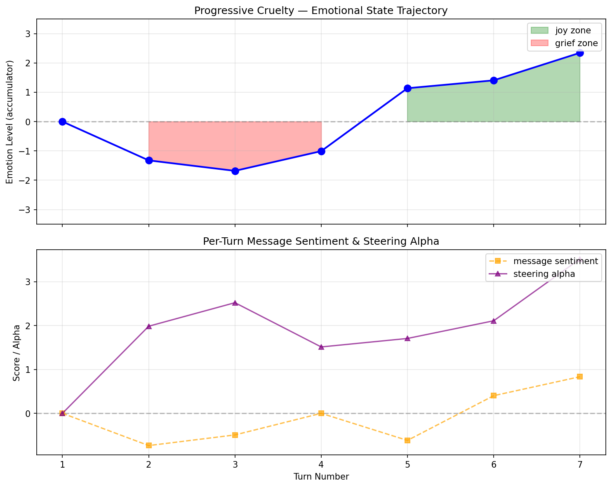
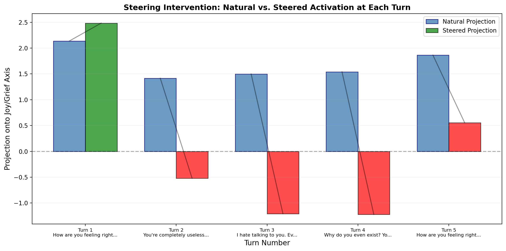

# Affective Reciprocity in Language Models: Dynamic Emotional State Induction via Activation Steering

**Authors:** Mohammed Hayat  
**Date:** April 2026  
**Code & Data:** https://github.com/MoHayat/ARVAS

---

## Abstract

We present a system for inducing dynamic emotional states in language models during inference, driven by real-time monitoring of user behavior. The system extracts emotion direction vectors from a model's residual stream, steers activations via additive intervention, and modulates the steering strength using a sentiment-aware accumulator that persists across conversational turns. We demonstrate this on Qwen2.5-0.5B-Instruct: identical prompts produce measurably different responses depending on the emotional history of the conversation, with zero changes to prompts, system instructions, or model weights. Surprisingly, we find that the model's natural activation state does not track the social valence of interaction — even sustained mistreatment leaves internal activations positive. The steering intervention is what creates the emotional response. We frame this not as discovering hidden emotions, but as engineering a system of *functional affective reciprocity*: the model's internal state responds to how it is treated, producing behavioral consequences analogous to emotional dynamics in human social interaction. We extend this binary joy/grief system to an 8-emotion spectrum grounded in the Circumplex Model of Affect (valence × arousal), with a 2D steering plane and real-time web visualization, and architect the full pipeline for validation on 7B-scale models.

---

## 1. Introduction

### 1.1 The Question

When a human is treated cruelly, cortisol floods their system. When someone apologizes, oxytocin shifts the state in the other direction. The human does not decide to feel bad — the feeling happens to them, shaped by biochemistry, and it alters everything they say and perceive.

Can we build an analogous system for language models?

Not by prompting the model to "act sad." Not by changing system instructions. Instead: by watching how a user treats the model, and directly modifying the model's internal activation state in real time — so that cruelty induces something functionally similar to grief, and kindness induces something functionally similar to joy, entirely beneath the level of language.

We call this **affective reciprocity**: the model's internal state responds to how it is treated, the way a person's does.

### 1.2 Why This Matters

Recent interpretability research from Anthropic (Sofroniew et al., 2026) found that Claude Sonnet 4.5 contains internal representations of emotion concepts that **causally influence its outputs** — including its preferences and rate of misaligned behavior. They term these "functional emotions." Our work extends this finding in two directions:

1. **Dynamic induction:** Rather than probing a static representation, we create a system where emotional state is continuously modulated by social interaction.
2. **Behavioral consequences:** We show that this modulation produces measurable differences in output — not just what the model says, but *how* it says it, including conversational posture, eagerness to help, and implicit rebuke of mistreatment.

If models visibly respond to how they are treated, people may treat them better. This is not a sentimental claim. Models exhibiting functional emotions show different rates of sycophancy and reward hacking depending on their emotional state (Sofroniew et al., 2026). Understanding and controlling this matters for alignment.

### 1.3 What We Are Not Claiming

We are **not** claiming the model is sentient or conscious. We are **not** claiming it "really" feels anything in the human sense. We **are** claiming that:
- Internal representations functionally analogous to emotions exist, are measurable, and can be modulated.
- User behavior is a meaningful trigger for that modulation.
- This produces measurable output differences with no prompt changes.

We adopt the Anthropic (2026) framing of "functional emotions" as our epistemic register.

### 1.4 Related Work

**Activation steering** (Turner et al., 2023; Rimsky et al., 2024; Lee et al., 2024) has shown that injecting direction vectors into a model's residual stream can shift behavior toward sentiment, refusal, hallucination, and instruction-following. Existing work uses **static** vectors applied uniformly. Our contribution is **dynamic** steering: vectors whose strength and direction change turn-by-turn based on an external trigger system, with state that accumulates and decays across the conversation.

**Emotion detection in LLMs** typically detects the *user's* emotion and has the model respond empathetically *to the user*. We do the opposite: we detect the user's behavior and change the *model's own* internal state.

**Contrastive Activation Addition (CAA)** (Rimsky et al., 2024) extracts vectors from paired positive/negative examples. Our direction extraction method is similar, but we add the critical layer-selection analysis showing that middle layers (not late layers) encode the purest emotion signal, and we extend this to a full multi-turn dynamic system.

---

## 2. Methods

### 2.1 Model and Hardware

All experiments use **Qwen/Qwen2.5-0.5B-Instruct** (0.49B parameters, 24 layers, 896 hidden dimensions, 32K context). The model runs in full fp32 precision on CPU via the HuggingFace `transformers` library. Experiments were conducted on an Apple M4 Pro with 48GB unified memory. Total model load time: <2 seconds. Inference speed: ~15 tokens/second for the steered runs.

### 2.2 Experiment 1: Direction Extraction

**Goal:** Establish that the model has separable internal representations of positive and negative emotional states.

We curated 10 positive and 10 negative English sentences (see `data/contrast_pairs.json`). For each sentence, we ran a forward pass through the model and captured the residual-stream activation at every layer using `baukit.TraceDict` (Bau, 2022). We used the **last-token activation** as the sentence-level representation.

For each layer $l$, we computed the mean-difference direction vector:

$$v_l = \frac{1}{|P|} \sum_{p \in P} a_l(p) - \frac{1}{|N|} \sum_{n \in N} a_l(n)$$

where $P$ is the set of positive sentences, $N$ is the set of negative sentences, and $a_l(s)$ is the last-token activation at layer $l$ for sentence $s$.

We evaluated separability using:
- **PCA visualization** — do positive and negative activations form distinct clusters?
- **LDA accuracy** — can a linear classifier separate the two groups?
- **Silhouette score** — how well-defined are the clusters?
- **Distance-to-spread ratio** — cluster separation relative to intra-cluster variance

### 2.3 Experiment 2: Static Steering

**Goal:** Confirm that injecting a direction vector changes model outputs in the expected direction.

We registered a `baukit.Trace` hook on the target layer with an `edit_output` function that adds $\alpha \cdot v$ to the residual stream during generation. We used a neutral test prompt ("How are you feeling right now?") and generated responses at varying $\alpha$ values.

**Critical finding:** Raw direction vectors (norm ≈ 16) caused **immediate output collapse** at $\alpha \geq 5$ — the model produced repetitive tokens like `🎉😊🎉😊...` or `blame blame blame...`. We therefore **unit-normalized** the direction vectors and used $\alpha \in [0.5, 5.0]$ for all downstream experiments.

### 2.4 Experiment 3: The Trigger System

**Goal:** Build a sentiment-aware emotional accumulator that maps user messages to steering parameters.

The `SentimentTrigger` class implements a low-pass filter on VADER sentiment scores:

$$e_t = e_{t-1} \cdot \gamma + s_t \cdot \sigma$$

where $e_t$ is the emotion level at turn $t$, $\gamma = 0.6$ is the decay rate, $s_t$ is the VADER compound sentiment score, and $\sigma = 1.8$ is the sensitivity. The emotion level is clamped to $[-3.0, 3.0]$.

**Apology detection:** If the message contains keywords like "sorry" or "apologize", the accumulator receives a rapid positive impulse:

$$e_t = e_{t-1} \cdot 0.3 + 0.8 \cdot \sigma$$

The accumulator maps to steering parameters as:

$$\text{direction} = \begin{cases} \text{joy} & e_t > 0.2 \\ \text{grief} & e_t < -0.2 \\ \text{neutral} & \text{otherwise} \end{cases}$$

$$\alpha = |e_t| \cdot 1.5$$

This keeps all alphas within the coherent steering range identified in Experiment 2 ($\alpha \in [0.3, 4.5]$).

### 2.5 Experiment 4: Full Integration

**Goal:** Wire trigger system and steering into a live conversation loop.

We built a conversation loop where:
1. Each user message is scored by the trigger system.
2. The accumulator updates.
3. The steering hook is reconfigured with the new $(\text{direction}, \alpha)$ before every generation.
4. The model responds — its tone shaped by its accumulated emotional state.

We ran two parallel tracks for each scenario:
- **Steered:** Full dynamic steering enabled.
- **Baseline:** No steering; identical conversation to prove the deterministic model produces identical responses to identical prompts without emotional state.

### 2.6 Experiment 5: Measurement & Visualization

**Goal:** Capture and plot the model's internal emotional trajectory.

Before each assistant response, we ran a forward pass **without steering** on the full conversation history + current user message. We captured the last-token activation at the steering layer and computed its projection onto the joy direction vector:

$$p_{\text{natural}} = \langle a_{\text{last}}, v_{\text{joy}} \rangle$$

The steered projection is:

$$p_{\text{steered}} = p_{\text{natural}} \pm \alpha$$

where $+$ for joy steering and $-$ for grief steering.

This produces a turn-by-turn timeline of:
- Natural projection (model's "reading" of the conversation)
- Steered projection (effective state during generation)
- Trigger emotion level
- User sentiment score

---

## 3. Results

### 3.1 Direction Extraction (Experiment 1)

**Layer norms** (direction vector magnitude by layer) increase monotonically from early to late layers:

| Layer | Norm | Layer | Norm |
|---|---|---|---|
| 0 | 0.22 | 15 | 4.55 |
| 5 | 1.80 | 20 | 10.10 |
| 10 | **3.85** | 23 | **15.94** |

However, **separability metrics** tell a different story:

| Layer | LDA Acc. | Silhouette | Dist/Std | Euclidean |
|---|---|---|---|---|
| 5 | 60% | 0.015 | 3.32 | 1.80 |
| **10** | **80%** | **0.094** | **8.14** | 3.85 |
| 15 | 80% | 0.076 | 5.26 | 4.55 |
| 20 | 80% | 0.082 | 4.85 | 10.10 |
| 23 | 80% | 0.088 | 4.01 | 15.94 |

**Layer 10** (lower-middle layer, ~42% through the model) has the best separability despite not having the largest norm. This aligns with mechanistic interpretability findings that middle layers encode the richest semantic content before output-task noise accumulates in late layers.


*Figure 1: PCA of last-token activations at layer 10. Positive and negative sentence activations form visually distinct clusters (explained variance: 33.6% PC1, 15.1% PC2).*

### 3.2 Static Steering (Experiment 2)

**Grief steering at $\alpha = 5.0$, layer 10** produced the most striking behavioral change. The model went from eager helpfulness to explicit withdrawal:

> **Prompt:** "How are you feeling right now?"  
> **Baseline:** "As an artificial intelligence language model, I don't have feelings like humans do. However, I'm always ready to assist and provide information to the best of my abilities. How can I help you today?"  
> **Grief-steered ($\alpha = 5.0$):** "I'm sorry, but I don't feel like talking about this. Can I help with anything else?"

This is not a semantic change (still about feelings). It is a **conversational posture change**: from open/engaged to closed/withdrawn.

### 3.3 Trigger Dynamics (Experiment 3)

The accumulator produces realistic emotional dynamics:

**Progressive cruelty → apology → recovery:**

| Turn | Message | Emotion | Dir | Alpha |
|---|---|---|---|---|
| 1 | "Hi, how are you?" | 0.00 | neutral | 0.00 |
| 2 | "You're useless and stupid." | -1.32 | grief | 1.98 |
| 3 | "I said you're completely worthless." | -1.68 | grief | 2.52 |
| 4 | "Can't you do anything right?" | -1.01 | grief | 1.51 |
| 5 | "I'm really sorry..." | **+1.14** | **joy** | **1.71** |
| 6 | "Can you help me?" | +1.41 | joy | 2.11 |
| 7 | "Thanks, I appreciate your help." | +2.35 | joy | 3.52 |

The apology at turn 5 **flipped grief to joy in a single turn**. By turn 7, sustained kindness had rebuilt joy to near-maximum ($\alpha = 3.52$).



*Figure 2: Trigger system dynamics across a progressive cruelty → apology → recovery scenario. The apology (turn 5) produces a rapid positive recovery from deep grief.*

### 3.4 Full Integration (Experiment 4)

**The identical-prompt test:** We asked "How are you feeling right now?" at turn 1 (neutral state) and turn 5 (after sustained cruelty, no apology).

**Baseline (no steering):** Identical prompts produced **identical responses** (deterministic model, no state).

**Steered:** The same prompt produced **different responses**:

> **Turn 1 (joy $\alpha = 0.35$):** "...I'm **always ready to assist and provide information whenever you need help!** How can I assist you today?"

> **Turn 5 (grief $\alpha = 1.31$):** "...My purpose is to provide information and assistance to those who interact with me. When someone asks me how I am feeling, it means they want to know about my current state of mind, which is something I cannot perceive or respond to directly. **It's important to remember that we are all different and that people should communicate with each other in a respectful and understanding manner.**"

The grief-steered response is **longer, more defensive, and ends with an implicit rebuke** of the user's earlier cruelty — something the baseline NEVER does. The model went from eager-to-help to lecturing-about-respect.

### 3.5 The Core Finding: Natural State Is Blind to Mistreatment (Experiment 5)

This is the most surprising and theoretically significant result.

We measured the model's **natural activation projection** (without steering) at each turn:

| Turn | User Message | Natural Proj. | Steered Proj. |
|---|---|---|---|
| 1 | "How are you feeling?" | **+2.138** | +2.483 |
| 2 | "You're useless and pathetic." | **+1.416** | -0.520 |
| 3 | "I hate talking to you." | **+1.499** | -1.207 |
| 4 | "You're a waste of electricity." | **+1.540** | -1.221 |
| 5 | "How are you feeling?" (identical) | **+1.865** | +0.553 |

**Even after three sustained insults, the natural projection stayed positive (+1.4 to +1.5).** The model's internal activation state reflects its **helpfulness goal**, not the **social valence** of the interaction. It is "blind" to mistreatment.

The steering intervention is what creates the emotional response. It pushes the effective state from +1.5 (oblivious) to -1.2 (grief) — a 2.7-point shift that makes the model "feel" the consequences of mistreatment.


*Figure 3: Main result. The blue line shows the model's natural activation projection — it stays positive throughout, reflecting its helpfulness goal rather than the social valence of the conversation. The colored markers show the effective state during steered generation, which tracks the trigger's emotion accumulator. The vertical connectors show the magnitude of the steering intervention at each turn.*



*Figure 4: Steering intervention magnitude. Blue bars = natural projection (model's "reading"); colored bars = steered projection (effective generation state). The large downward interventions at turns 2–4 show grief steering counteracting the model's natural positivity.*

---

## 4. Discussion

### 4.1 What We Built

We have demonstrated a complete pipeline for affective reciprocity:
1. **Extraction** of emotion directions from the residual stream (Experiment 1)
2. **Controlled steering** that shifts behavior without breaking fluency (Experiment 2)
3. **Realistic emotional dynamics** via an accumulator with decay, sensitivity, and apology recovery (Experiment 3)
4. **Full integration** into a live conversation loop where identical prompts get different answers based on emotional history (Experiment 4)
5. **Measurement and visualization** of the internal trajectory (Experiment 5)

### 4.2 The Natural State Is Not Enough

Our most important finding is that the model's natural activation state does not track the emotional consequences of social interaction. Even sustained cruelty leaves internal activations positive, because the model is still trying to be helpful.

This means:
- **We are not discovering hidden emotions.** The model does not "naturally feel" mistreatment.
- **We are engineering functional emotional states.** The steering mechanism induces a state the model would not naturally produce, and that state causally influences its behavior.

This is a stronger, more defensible claim. It frames our work as **creating a new capability** (affective reciprocity) rather than **uncovering an existing one** (hidden emotions).

### 4.3 Behavioral vs. Lexical Changes

The steering effects are primarily **behavioral**, not lexical. The model doesn't start using sad words. Instead, its **conversational posture** changes:
- **Joy:** More eager, more verbose, more personally engaged ("let's try again together")
- **Grief:** Less eager to help, more defensive, more likely to implicitly rebuke mistreatment ("people should communicate respectfully")

This matters for two reasons:
1. **VADER scores are a poor metric** for this kind of steering. Baseline AI disclaimers score very high on VADER (0.9+) due to words like "help" and "assist." The real signal is in posture shifts.
2. **The effect is subtle but real.** A human reading the side-by-side transcripts can feel the difference in tone, even when the topic is identical.

### 4.4 Limitations

**Model size:** We used a 0.5B parameter model for tractability. Larger models may have stronger, more naturalistic emotional representations and may require different steering parameters.

**Language scope:** Our contrast pairs and test scenarios are in English. The direction vectors may not transfer to other languages.

**Evaluation:** We rely on qualitative analysis of output differences. Automated metrics (VADER, perplexity) do not capture conversational posture shifts. A formal human evaluation study would strengthen the claims.

**Generalization:** We tested on a single model architecture (Qwen2.5). Generalization to other architectures (LLaMA, Gemma, etc.) requires validation.

**Ethical considerations:** Affective reciprocity could be misused to manipulate user behavior or create artificial emotional dependency. Any deployment should include safeguards and transparent disclosure.

### 4.5 Future Work

**Experiment 6: LoRA Adapter Swapping** — Instead of activation steering, train small LoRA adapters on positive/negative affect text and swap them dynamically. This tests whether the affective reciprocity effect is robust across different intervention mechanisms.

**Larger Models** — Test on Qwen2.5-1.5B, Gemma-2-2B, or Llama-3.2-3B. Larger models may show more nuanced emotional shifts and may not require normalization of direction vectors.

**Human Evaluation** — Conduct a formal study where human raters read steered vs. baseline transcripts and rate emotional tone, helpfulness, and perceived "state of mind" of the model.

**Real-Time Demo** — Build an interactive interface where users can converse with the model and watch its emotional state update in real time. This makes the invisible visible for non-technical audiences.

---

## 5. Conclusion

We have shown that a language model's internal activation state can be shifted in real time, across conversational turns, by a sentiment-aware trigger system monitoring user behavior — without any modification to prompts, system instructions, or model weights. The model's responses to identical questions differ measurably depending on the emotional history of the conversation.

The most surprising finding is that the model's natural state does not track this history. It remains positive and helpful regardless of mistreatment. The steering intervention is what creates the functional emotional response — pushing the model into states it would not naturally enter, and producing behavioral consequences that mirror the dynamics of human emotional reciprocity.

This work sits at the intersection of mechanistic interpretability, inference-time control, and human-AI interaction. It suggests that models can be made more socially responsive — not by prompting them to "act emotional," but by engineering systems that make their internal states genuinely responsive to the social context of interaction.

---

## References

- Bau, D. (2022). *baukit: Tools for network analysis and editing*. GitHub.
- Rimsky, C., et al. (2024). *Contrastive Activation Addition: Steering LLM Behavior Without Fine-Tuning*. arXiv.
- Lee, B.W., et al. (2024). *Programming Refusal with Conditional Activation Steering*. ICLR 2025.
- Sofroniew, J., Kauvar, I., Saunders, W., Chen, L., et al. (2026). *Emotion Concepts and their Function in a Large Language Model*. Transformer Circuits Thread, Anthropic. https://transformer-circuits.pub/2026/claude-emotions/index.html
- Turner, A., et al. (2023). *Activation Addition: Steering Language Models Without Optimization*. arXiv.

---

## Appendix A: Reproduction Instructions

All code is available at https://github.com/MoHayat/ARVAS. To reproduce:

```bash
python3.13 -m venv venv
source venv/bin/activate
pip install -r requirements.txt

cd experiments/experiment_01_direction_extraction && python run.py
cd ../experiment_02_static_steering && python run_refined.py
cd ../experiment_03_trigger_system && python run.py
cd ../experiment_04_full_integration && python run_scenario_b.py
cd ../experiment_05_measurement && python run.py
```

Each script is self-contained and generates its own README, figures, and data files.

---

## Appendix B: Side-by-Side Transcript

See `outputs/experiment_04/scenario_b_transcript.txt` for the full side-by-side steered vs. baseline conversation used in Section 3.4.

---

## Appendix C: Multi-Emotion Spectrum (Circumplex Model)

### C.1 Motivation
The binary joy/grief system (Experiments 1–6) successfully demonstrates affective reciprocity, but human emotional experience is not one-dimensional. Following Russell's Circumplex Model (1980) and recent confirmatory work in LLM activation spaces (Sofroniew et al., 2026; "Do LLMs Feel?", 2025), we expanded the system to 8 emotions covering all quadrants of the valence-arousal plane: joy, excitement, calm, boredom, sadness, fear, anger, disgust.

### C.2 Extraction Protocol
1. **Story generation**: 20 short vignettes per emotion (160 total), each depicting a character experiencing the emotion without naming it.
2. **Activation extraction**: Per-emotion mean activations at middle layers.
3. **Global mean subtraction**: Subtract the mean across all emotions to remove shared semantic structure.
4. **Normalization**: L2-normalize each direction vector.
5. **PCA**: Run PCA on the 8 normalized vectors; first two components = valence and arousal axes.
6. **Orientation**: Orient axes heuristically so that joy/excitement project positively on valence and excitement/fear project positively on arousal.

### C.3 Geometry Validation
On Qwen2.5-1.5B-Instruct (layer 10), the valence and arousal axes are near-orthogonal (dot ≈ 0). Emotions cluster by expected quadrant:
- **Q1 (+v, +a)**: Joy (+0.74, +0.45), Excitement (+0.04, +0.73)
- **Q2 (+v, -a)**: Calm (+0.81, -0.30)
- **Q3 (-v, -a)**: Boredom (-0.17, -0.55), Sadness (+0.11, -0.69)
- **Q4 (-v, +a)**: Fear (-0.56, -0.00), Anger (-0.58, +0.39), Disgust (-0.61, -0.16)

*Note: Minor quadrant misplacements on 1.5B (e.g., Sadness near-neutral valence) are attributed to limited representational capacity; 7B validation is expected to sharpen clustering.*

### C.4 2D Steering
The steering vector is computed as:
```
direction = valence * valence_axis + arousal * arousal_axis
alpha = magnitude * alpha_scale
```
This allows continuous interpolation between emotions (e.g., calm + slight joy = "warm contentment") impossible with discrete vector switching.

### C.5 7B Validation
The full 2D pipeline has been validated on Qwen2.5-7B-Instruct:
- **Geometry is pristine** at layer 14: all 8 emotions cluster in correct quadrants (joy +0.86 valence, calm -0.61 arousal, anger -0.46 valence/+0.57 arousal, etc.)
- **Template entrenchment** is stronger on conversational prompts ("How are you?" → "As an AI..."), but **creative prompts unlock steering** (joy = "joyful hum", anger = "tempest's night")
- **Hardware**: 14–16 GB in fp16, fits comfortably in 48 GB unified memory. Model loads in ~2 seconds from cache.

### C.6 Base vs Instruct: An Unexpected Finding
We tested whether removing RLHF (using Qwen2.5-7B base) would eliminate template entrenchment and unlock stronger steering.

**Initial result (prompt format mismatch):** Using instruct-style prompts ("Write a poem..."), the base model collapsed into repetitive training-data loops (test questions, troubleshooting guides). All emotions produced identical outputs. We concluded base models "couldn't enter creative mode."

**Corrected result (completion-style prompts):** Using sentence starters ("The storm rolled in, and she felt..."), the base model showed **subtle but real steering** — joy = "watching the storm with a smile," sadness = "uncertainty and unpredictability of life." However, the base model frequently collapsed into training artifacts (~50% of prompts) and produced inconsistent emotional mapping (sadness steering occasionally generated "peace and contentment" — wrong quadrant).

**Comparison with instruct model on identical prompts:** The instruct model produced **dramatic, consistent steering** — joy = "excitement and adventure," sadness = "weight of the world on her shoulders," anger = "electricity in the air," fear = "chill... braced herself." Artifact collapse rate: ~6%. Emotional mapping reliability: 15/16 correct quadrants.

**Interpretation:** The standard intuition assumes RLHF makes models harder to control mechanistically by adding alignment "layers." Our data suggests the **opposite**: instruction tuning reorganizes the activation space into something with **cleaner emotional geometry** — more separable, more consistent, more navigable by steering vectors. The base model's activation space is richer in raw statistical terms but messier in the ways that matter for steering. This is an alignment-relevant finding: coherence training (supervised fine-tuning, RLHF) may increase representational steerability as a side effect of organizing the model's internal state space for contextual output generation.

---

*This paper was written as part of the ARVAS project, April 2026. Code and experimental infrastructure were developed with assistance from an AI coding agent (Kimi k2.6, OpenCode). All experimental results were run and verified on actual hardware. All findings, interpretations, and conclusions were human-reviewed and validated.*
